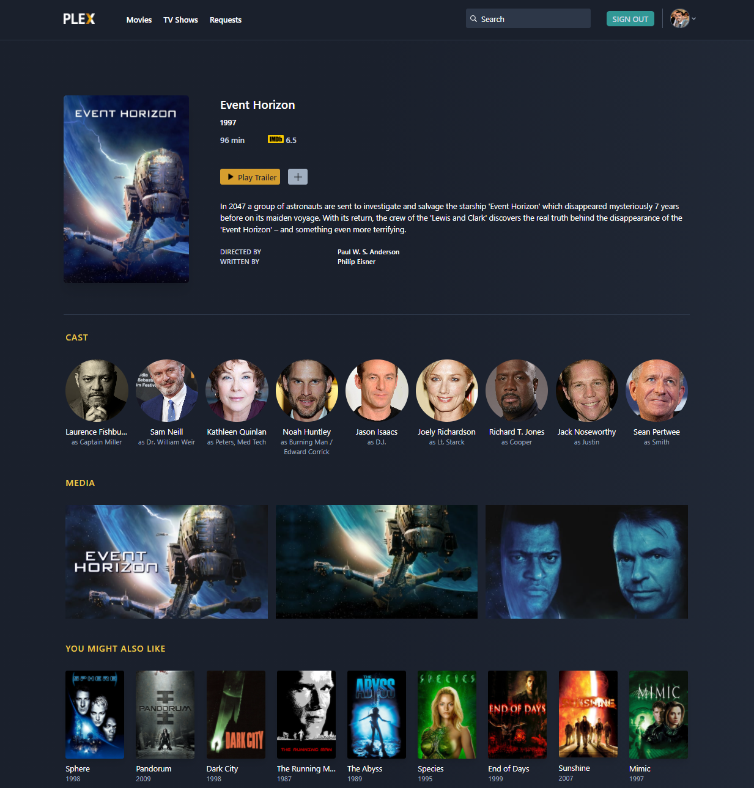

# RePlext

  RePlext is a Request & Discover web application platform that gives Plex users the ability to easily search, manage and request content.   

# RePlext as a learning exercise

  Rather than diving directly into using frameworks to expedite the development process, I chose to first try building everything from scratch as a valuable learning experience. Frameworks such as Laravel offer an out-of-the-box HTTP client, authentication, ORM, etc. built around MVC architecture to make development easier and scalable. I felt that in order to fully appreciate and understand why web frameworks are so essential in modern web development, I had to encounter and experience some of the difficulties and challenges that are encountered in their absence. 
  
  In its current iteration, there's a lot of improvement required in the application's back-end organization. The business logic isin't separated enough from the view at present, and would benefit from seperation into views and controller folders. The HTTP request organization and speed would greatly benefit from using cURL or an HTTP request client such as Guzzle.
  
  As for the front-end, I used Tailwind CSS for styling. Having acquired an understanding of HTML and CSS when creating my portfolio website, I found Tailwind CSS very intuitive and helpful in creating flexible and responsive layouts.
  
Lots more to work on, still a work in progress.

